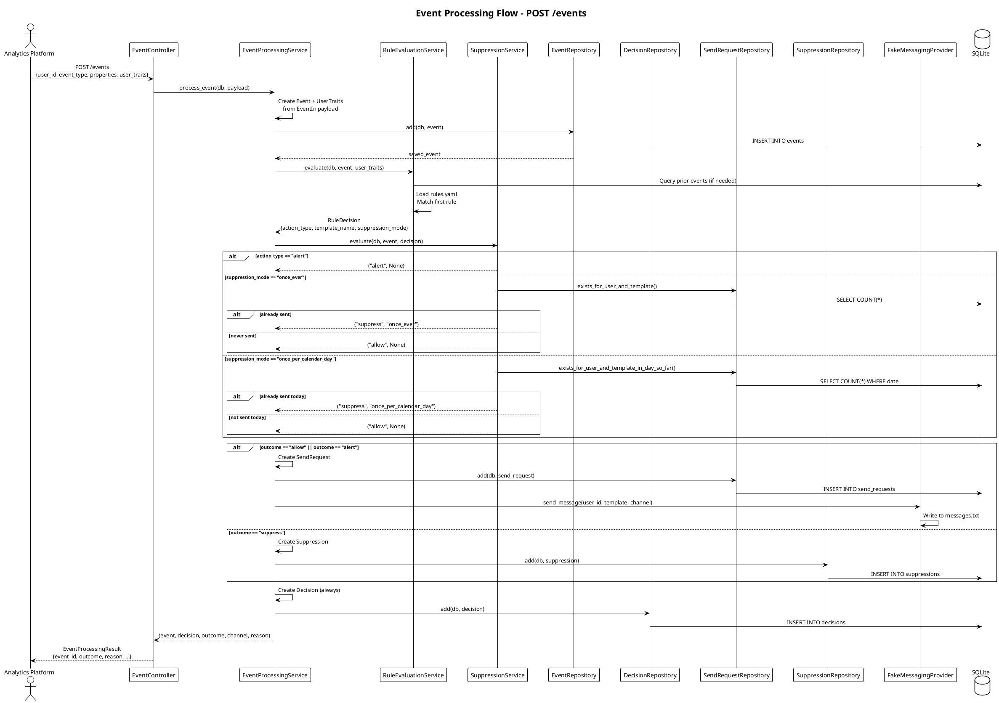
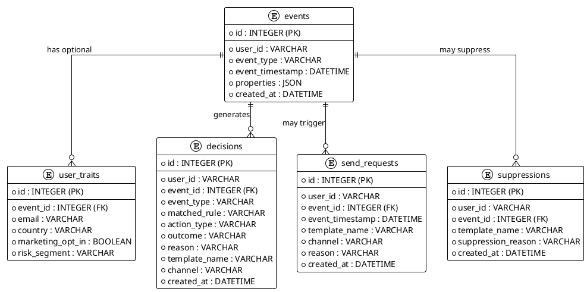

# Marketing Messaging Service 📬

A backend service that processes behavioral events and triggers rule-based marketing messages with deduplication and audit logging.

## Table of Contents

### Main Documentation
- [Tech Stack 🛠️](#tech-stack-️)
- [How to Run 🚀](#how-to-run-)
  - [Environment Setup](#environment-setup)
  - [Launch Service](#launch-service)
- [API Documentation 📖](#api-documentation-)
- [Example API Usage 📡](#example-api-usage-)
  - [POST Event - Payment Failed Example 💳](#post-event---payment-failed-example-)
  - [GET Audit - View Decision History 📋](#get-audit---view-decision-history-)
- [Rule Configuration ⚙️](#rule-configuration-️)
- [Architecture Notes 🏗️](#architecture-notes-️)
  - [Database Connectivity 💾](#database-connectivity-)
  - [Timestamp Handling ⏰](#timestamp-handling-)
  - [Type Safety 🔒](#type-safety-)
  - [Clean Architecture 🎯](#clean-architecture-)

### Architecture Documentation
- [C4 Level 1: System Context 🌍](#c4-level-1-system-context-)
- [C4 Level 2: Container Diagram 📦](#c4-level-2-container-diagram-)
- [C4 Level 3: Component Diagram 🔧](#c4-level-3-component-diagram-)
- [Event Processing Flow Diagram 🔄](#event-processing-flow-diagram-)
- [Key Architectural Patterns 📐](#key-architectural-patterns-)
- [Database Schema Overview 🗄️](#database-schema-overview-️)
- [Technology Stack Details 🛠️](#technology-stack-details-️)

---

## Tech Stack 🛠️

- **Framework**: FastAPI
- **Database**: SQLite, (SQLAlchemy 2.0 with `Mapped` types for type safety)  
- **Validation**: Pydantic v2 for request/response models
- **Configuration**: YAML-based rule definitions
- **Database**: SQLite (configurable to PostgreSQL/other databases)
- **Timestamps**: Timezone-aware UTC handling throughout

## How to Run 🚀

### Environment Setup

1. **Install dependencies**:
   ```bash
   poetry install
   ```

2. **Optional environment variables**:
   ```bash
   # Create .env file (optional)
   API_HOST=127.0.0.1
   API_PORT=8000
   DATABASE_URL=sqlite:///./messaging.db  # Default path
   ```

### Launch Service

```bash
python main.py
```

The service will start on `http://127.0.0.1:8000` with automatic reload enabled for development.

**Note**: When messages are triggered, they will be written to `messages.txt` in the root directory as a stub implementation of the messaging provider.

## API Documentation 📖

Once running, visit `http://127.0.0.1:8000/docs` for interactive Swagger documentation.

## Example API Usage 📡

### POST Event - Payment Failed Example 💳

Process a payment failure event with user traits and properties:

```http
POST http://127.0.0.1:8000/events/
Content-Type: application/json

{
  "user_id": "user_12345",
  "event_type": "payment_failed",
  "event_timestamp": "2024-01-15T10:30:00Z",
  "properties": {
    "failure_reason": "INSUFFICIENT_FUNDS",
    "attempt_number": 1,
    "amount": 29.99,
    "currency": "USD"
  },
  "user_traits": {
    "email": "john.doe@example.com",
    "country": "US",
    "marketing_opt_in": true,
    "risk_segment": "low"
  }
}
```

**Expected Response**:
```json
{
  "event_id": 123,
  "user_id": "user_12345",
  "event_type": "payment_failed",
  "matched_rule": "insufficient_funds_email",
  "action_type": "send",
  "template_name": "INSUFFICIENT_FUNDS_EMAIL",
  "channel": "email",
  "outcome": "allow",
  "reason": "Rule matched and suppression check passed"
}
```

### GET Audit - View Decision History 📋

Retrieve complete audit trail for a user:

```http
GET http://127.0.0.1:8000/audit/user_12345
```

**Expected Response**:
```json
{
  "user_id": "user_12345",
  "decisions": [
    {
      "event_id": 123,
      "event_type": "payment_failed",
      "event_timestamp": "2024-01-15T10:30:00Z",
      "matched_rule": "insufficient_funds_email",
      "action_type": "send",
      "template_name": "INSUFFICIENT_FUNDS_EMAIL",
      "outcome": "allow",
      "reason": "Rule matched and suppression check passed",
      "decision_timestamp": "2024-01-15T10:30:01Z"
    }
  ]
}
```

## Rule Configuration ⚙️

The service evaluates events against rules defined in `config/rules.yaml`. Each rule specifies:

- **Trigger**: Which event type activates the rule
- **Conditions**: User traits and event property filters  
- **Action**: Message template and delivery channel
- **Suppression**: Deduplication logic (none, once_ever, once_per_calendar_day)

Example rule for payment failures:
```yaml
- name: "insufficient_funds_email"
  description: "Send insufficient funds email once per calendar day"
  enabled: true
  trigger:
    event_type: "payment_failed"
  conditions:
    all:
      - field: "properties.failure_reason"
        operator: "equals"
        value: "INSUFFICIENT_FUNDS"
  action:
    type: "send"
    template_name: "INSUFFICIENT_FUNDS_EMAIL"
    delivery_method: "email"
  suppression:
    mode: "once_per_calendar_day"
```

## Architecture Notes 🏗️

### Database Connectivity 💾
- **Default**: SQLite database at `./messaging.db`
- **Production**: Configure `DATABASE_URL` environment variable for PostgreSQL
- **Migrations**: Managed via Alembic (see `alembic/` directory)

### Timestamp Handling ⏰
All timestamps are stored and processed as timezone-aware UTC `datetime` objects, ensuring consistency across different deployment environments and compliance with modern Python standards.

### Type Safety 🔒
The codebase uses SQLAlchemy 2.0 `Mapped[Type]` annotations throughout for compile-time type checking and improved IDE support, following modern Python typing best practices.

### Clean Architecture 🎯
The service implements a layered architecture pattern:
- **Controllers**: HTTP request/response handling
- **Services**: Business logic and orchestration  
- **Repositories**: Data access layer with clean interfaces
- **Models**: SQLAlchemy entities with proper relationships

This separation enables easy testing, maintainability, and future scaling of the messaging infrastructure.


# Marketing Messaging Service - C4 Architecture Documentation 🏗️

This document provides comprehensive C4-style architecture diagrams for the Marketing Messaging Service, showing the system from different levels of abstraction.

## C4 Level 1: System Context 🌍

Shows external actors and systems that interact with our service.

```plantuml
@startuml C4_Context
!include https://raw.githubusercontent.com/plantuml-stdlib/C4-PlantUML/master/C4_Context.puml

LAYOUT_WITH_LEGEND()
LAYOUT_TOP_DOWN()

skinparam linetype ortho
skinparam nodesep 100
skinparam ranksep 80

title System Context - Marketing Messaging Service

Person(growth_team, "Growth Team", "Investigates why users didn't receive messages")
Person(cx_team, "CX Team", "Responds to high-risk payment alerts")

System(messaging_service, "Marketing Messaging Service", "Processes behavioral events, evaluates rules, applies suppression logic, triggers messages, maintains audit trail")

System_Ext(analytics_platform, "Analytics Platform", "Sends behavioral events\n(Segment, mParticle, etc.)")
System_Ext(messaging_provider, "Messaging Provider", "Delivers emails/SMS\n(Iterable, Braze)\nStubbed in implementation")

Rel_D(analytics_platform, messaging_service, "POST /events", "JSON event payload\nwith user traits")
Rel_R(messaging_service, messaging_provider, "Send Message", "Stubbed to messages.txt")
Rel_U(growth_team, messaging_service, "GET /audit/{user_id}", "View decision history")
Rel_U(cx_team, messaging_service, "GET /audit/{user_id}", "Check alerts and outcomes")

@enduml
```

**Key System Boundaries:**
- **Internal**: FastAPI service, rule evaluation engine, suppression logic, SQLite persistence
- **External**: Analytics platform (event source), messaging providers (delivery stub)
- **Actors**: Growth and CX teams consuming audit trails for analysis

---

## C4 Level 2: Container Diagram 📦

Shows the internal architecture with layered components and their interactions.

```plantuml
@startuml C4_Container
!include https://raw.githubusercontent.com/plantuml-stdlib/C4-PlantUML/master/C4_Container.puml

LAYOUT_WITH_LEGEND()
LAYOUT_LEFT_RIGHT()

skinparam linetype ortho
skinparam nodesep 120
skinparam ranksep 100

title Container Diagram - Marketing Messaging Service (Layered Architecture)

System_Ext(analytics, "Analytics Platform", "Event Source")
Person(teams, "Internal Teams", "Growth & CX")
System_Ext(provider, "Messaging Provider", "Email/SMS Delivery")

Container_Boundary(api_layer, "API Layer") {
    Container(fastapi_app, "FastAPI Application", "Python, FastAPI", "HTTP API with health check\nand router registration")
    Container(event_controller, "Event Controller", "FastAPI Router", "POST /events\nIngests behavioral events")
    Container(audit_controller, "Audit Controller", "FastAPI Router", "GET /audit/{user_id}\nServes decision history")
}

Container_Boundary(service_layer, "Service Layer") {
    Container(event_processing, "EventProcessingService", "Python", "Orchestrates entire event\nprocessing workflow")
    Container(rule_evaluation, "RuleEvaluationService", "Python", "Evaluates YAML rules\nagainst events")
    Container(suppression, "SuppressionService", "Python", "Applies deduplication\nlogic (once_ever, daily)")
    Container(audit_service, "AuditService", "Python", "Retrieves decision\naudit trails")
}

Container_Boundary(repository_layer, "Repository Layer") {
    Container(event_repo, "EventRepository", "SQLAlchemy", "Event & UserTraits\npersistence")
    Container(send_repo, "SendRequestRepository", "SQLAlchemy", "Successful message\ndelivery tracking")
    Container(suppress_repo, "SuppressionRepository", "SQLAlchemy", "Suppression event\nlogging")
    Container(decision_repo, "DecisionRepository", "SQLAlchemy", "Complete decision\naudit trail")
}

Container_Boundary(infrastructure, "Infrastructure") {
    ContainerDb(database, "SQLite Database", "SQLite", "Event data, decisions,\nsuppression history")
    Container(rules_config, "Rules Configuration", "YAML", "Configurable marketing\nrules and conditions")
    Container(fake_provider, "FakeMessagingProvider", "Python", "Stub implementation\nwrites to messages.txt")
}

' External connections
Rel_D(analytics, event_controller, "POST /events", "JSON")
Rel_U(teams, audit_controller, "GET /audit", "HTTP")

' API Layer connections
Rel_D(fastapi_app, event_controller, "includes", "router")
Rel_D(fastapi_app, audit_controller, "includes", "router")

' Controller to Service connections
Rel_D(event_controller, event_processing, "delegates to", "EventIn payload")
Rel_D(audit_controller, audit_service, "delegates to", "user_id")

' Service orchestration
Rel_R(event_processing, rule_evaluation, "evaluates rules", "Event + UserTraits")
Rel_R(event_processing, suppression, "checks suppression", "RuleDecision")
Rel_D(event_processing, fake_provider, "send message", "stubbed")

' Service to Repository connections
Rel_D(event_processing, event_repo, "persist", "Event + UserTraits")
Rel_D(event_processing, send_repo, "persist", "SendRequest (if allow/alert)")
Rel_D(event_processing, suppress_repo, "persist", "Suppression (if suppress)")
Rel_D(event_processing, decision_repo, "persist", "Decision (always)")
Rel_D(audit_service, decision_repo, "query", "by user_id")

' Repository to Database connections
Rel_D(event_repo, database, "read/write", "SQL")
Rel_D(send_repo, database, "read/write", "SQL")
Rel_D(suppress_repo, database, "read/write", "SQL")
Rel_D(decision_repo, database, "read/write", "SQL")

' Configuration dependencies
Rel_U(rule_evaluation, rules_config, "loads", "rules.yaml")

' External provider connection
Rel_R(fake_provider, provider, "simulates", "messages.txt")

@enduml
```

---

## C4 Level 3: Component Diagram 🔧

Shows detailed component interactions within the service layer with dependency injection.

```plantuml
@startuml C4_Component
!include https://raw.githubusercontent.com/plantuml-stdlib/C4-PlantUML/master/C4_Component.puml

LAYOUT_WITH_LEGEND()
LAYOUT_TOP_DOWN()

skinparam linetype ortho
skinparam nodesep 150
skinparam ranksep 120

title Component Diagram - Service Layer Detail

Container_Ext(controllers, "FastAPI Controllers", "HTTP Endpoints")
Container_Ext(repositories, "Repository Layer", "Data Access")
Container_Ext(providers, "Messaging Providers", "External Communication")

Container_Boundary(services, "Service Layer Components") {
    Component(event_processing, "EventProcessingService", "Python", "• Orchestrates entire workflow\n• Creates domain models from DTOs\n• Coordinates rule evaluation\n• Manages persistence strategy")
    
    Component(rule_evaluation, "RuleEvaluationService", "Python", "• Loads YAML configuration\n• Matches events to rules\n• Evaluates conditions (field, prior_event)\n• Returns RuleDecision")
    
    Component(suppression, "SuppressionService", "Python", "• Applies deduplication logic\n• Checks once_ever suppression\n• Validates calendar day limits\n• Returns (outcome, reason)")
    
    Component(audit_service, "AuditService", "Python", "• Retrieves decision history\n• Formats audit responses\n• Time-ordered results")
}

Container_Boundary(models, "Domain Models") {
    Component(event_model, "Event", "SQLAlchemy", "• user_id, event_type\n• event_timestamp\n• properties (JSON)")
    Component(user_traits_model, "UserTraits", "SQLAlchemy", "• email, country\n• marketing_opt_in\n• risk_segment")
    Component(decision_model, "Decision", "SQLAlchemy", "• Complete audit record\n• matched_rule, outcome\n• reason, template_name")
    Component(send_request_model, "SendRequest", "SQLAlchemy", "• Successful delivery tracking\n• template_name, channel")
    Component(suppression_model, "Suppression", "SQLAlchemy", "• Suppression event log\n• suppression_reason")
    Component(rule_decision_model, "RuleDecision", "Pydantic", "• Intermediate decision object\n• action_type, suppression_mode")
}

Container_Boundary(interfaces, "Repository Interfaces") {
    Component(event_interface, "IEventRepository", "ABC", "• add(), get_by_id()\n• exists_by_user_and_type_in_window()")
    Component(send_interface, "ISendRequestRepository", "ABC", "• exists_for_user_and_template()\n• exists_in_day_so_far()")
    Component(suppress_interface, "ISuppressionRepository", "ABC", "• add()")
    Component(decision_interface, "IDecisionRepository", "ABC", "• add(), list_by_user()")
    Component(provider_interface, "IMessagingProvider", "ABC", "• send_message()")
}

' External connections
Rel_D(controllers, event_processing, "injects dependencies")
Rel_D(controllers, audit_service, "delegates to")

' Service dependencies
Rel_R(event_processing, rule_evaluation, "uses", "evaluate()")
Rel_R(event_processing, suppression, "uses", "evaluate()")

' Service to Interface dependencies
Rel_D(event_processing, event_interface, "depends on")
Rel_D(event_processing, send_interface, "depends on")
Rel_D(event_processing, suppress_interface, "depends on")
Rel_D(event_processing, decision_interface, "depends on")
Rel_D(event_processing, provider_interface, "depends on")

Rel_D(rule_evaluation, event_interface, "depends on")
Rel_D(suppression, send_interface, "depends on")
Rel_D(suppression, suppress_interface, "depends on")
Rel_D(audit_service, decision_interface, "depends on")

' Interface to external connections
Rel_D(event_interface, repositories, "implemented by")
Rel_D(send_interface, repositories, "implemented by")
Rel_D(suppress_interface, repositories, "implemented by")
Rel_D(decision_interface, repositories, "implemented by")
Rel_D(provider_interface, providers, "implemented by")

' Domain model relationships
Rel_R(event_model, user_traits_model, "has optional", "1:0..1")
Rel_D(decision_model, event_model, "references", "FK")
Rel_D(send_request_model, event_model, "references", "FK")
Rel_D(suppression_model, event_model, "references", "FK")

' Service to Model usage
Rel_D(event_processing, event_model, "creates")
Rel_D(event_processing, user_traits_model, "creates")
Rel_D(event_processing, decision_model, "creates")
Rel_D(event_processing, send_request_model, "creates")
Rel_D(event_processing, suppression_model, "creates")
Rel_R(rule_evaluation, rule_decision_model, "creates")

@enduml
```

---

## Event Processing Flow Diagram 🔄

Detailed sequence showing the complete event processing workflow.



---

## Key Architectural Patterns 📐

### 1. Layered Architecture 🏢
- **Controllers**: HTTP request/response handling with dependency injection
- **Services**: Business logic orchestration with clear responsibilities  
- **Repositories**: Data access abstraction with interface contracts
- **Models**: Rich domain objects with proper SQLAlchemy relationships

### 2. Dependency Injection 💉
All services receive their dependencies via constructor injection, enabling:
- **Testability**: Easy mocking of dependencies
- **Flexibility**: Swappable implementations (e.g., different messaging providers)
- **Separation of Concerns**: Clear boundaries between layers

### 3. Interface Segregation 🔌
Repository interfaces define clean contracts:
- `IEventRepository`: Event persistence and querying
- `ISendRequestRepository`: Delivery tracking with suppression queries
- `ISuppressionRepository`: Suppression event logging
- `IDecisionRepository`: Complete audit trail persistence
- `IMessagingProvider`: External messaging abstraction

### 4. Domain-Driven Design 🎯
Rich domain models with clear relationships:
- **Event** ← **UserTraits** (optional 1:1)
- **Decision** → **Event** (FK relationship)
- **SendRequest** → **Event** (FK relationship)  
- **Suppression** → **Event** (FK relationship)

### 5. Configuration as Code ⚙️
YAML-based rule configuration enables:
- **Runtime flexibility**: No code changes for new campaigns
- **Business user empowerment**: Growth teams can modify rules
- **Version control**: Rule changes tracked in git

---

## Database Schema Overview 🗄️



---

## Technology Stack Details 🛠️

### Core Framework
- **FastAPI**: Async web framework with automatic OpenAPI documentation
- **SQLAlchemy 2.0**: Modern ORM with `Mapped[Type]` annotations for type safety
- **Pydantic**: Request/response validation with Python type hints
- **Alembic**: Database migration management

### Infrastructure  
- **SQLite**: Default database (configurable to PostgreSQL)
- **Poetry**: Dependency management and virtual environments
- **YAML**: Human-readable configuration for marketing rules

### Development
- **Modern Python 3.11+**: Leveraging union types (`str | None`) and enhanced typing
- **Clean Architecture**: Dependency inversion with interface abstractions
- **UTC Timestamps**: Timezone-aware datetime handling throughout