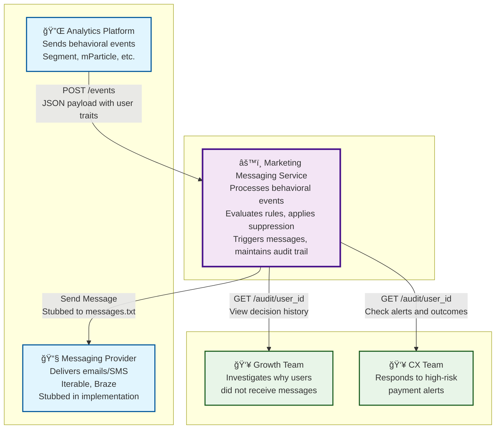

# Marketing Messaging Service 📬

A backend service that processes behavioral events and triggers rule-based marketing messages with deduplication and audit logging.

## Table of Contents

### Main Documentation
- [Tech Stack 🛠️](#tech-stack-️)
- [How to Run 🚀](#how-to-run-)
  - [Environment Setup](#environment-setup)
  - [Launch Service](#launch-service)
- [API Documentation 📖](#api-documentation-)
- [Example API Usage 📡](#example-api-usage-)
  - [POST Event - Payment Failed Example 💳](#post-event---payment-failed-example-)
  - [GET Audit - View Decision History 📋](#get-audit---view-decision-history-)
- [Rule Configuration ⚙️](#rule-configuration-️)
- [Architecture Notes 🏗️](#architecture-notes-️)
  - [Database Connectivity 💾](#database-connectivity-)
  - [Timestamp Handling ⏰](#timestamp-handling-)
  - [Type Safety 🔒](#type-safety-)
  - [Clean Architecture 🎯](#clean-architecture-)

### Architecture Documentation
- [C4 Level 1: System Context 🌍](#c4-level-1-system-context-)
- [C4 Level 2: Container Diagram 📦](#c4-level-2-container-diagram-)
- [C4 Level 3: Component Diagram 🔧](#c4-level-3-component-diagram-)
- [Event Processing Flow Diagram 🔄](#event-processing-flow-diagram-)
- [Key Architectural Patterns 📐](#key-architectural-patterns-)
- [Database Schema Overview 🗄️](#database-schema-overview-️)
- [Technology Stack Details 🛠️](#technology-stack-details-️)

---

## Tech Stack 🛠️

- **Framework**: FastAPI
- **Database**: SQLite, (SQLAlchemy 2.0 with `Mapped` types for type safety)  
- **Validation**: Pydantic v2 for request/response models
- **Configuration**: YAML-based rule definitions
- **Database**: SQLite (configurable to PostgreSQL/other databases)
- **Timestamps**: Timezone-aware UTC handling throughout

## How to Run 🚀

### Environment Setup

1. **Install dependencies**:
   ```bash
   poetry install
   ```

2. **Optional environment variables**:
   ```bash
   # Create .env file (optional)
   API_HOST=127.0.0.1
   API_PORT=8000
   DATABASE_URL=sqlite:///./messaging.db  # Default path
   ```

### Launch Service

```bash
python main.py
```

The service will start on `http://127.0.0.1:8000` with automatic reload enabled for development.

**Note**: When messages are triggered, they will be written to `messages.txt` in the root directory as a stub implementation of the messaging provider.

## API Documentation 📖

Once running, visit `http://127.0.0.1:8000/docs` for interactive Swagger documentation.

## Example API Usage 📡

### POST Event - Payment Failed Example 💳

Process a payment failure event with user traits and properties:

```http
POST http://127.0.0.1:8000/events/
Content-Type: application/json

{
  "user_id": "user_12345",
  "event_type": "payment_failed",
  "event_timestamp": "2024-01-15T10:30:00Z",
  "properties": {
    "failure_reason": "INSUFFICIENT_FUNDS",
    "attempt_number": 1,
    "amount": 29.99,
    "currency": "USD"
  },
  "user_traits": {
    "email": "john.doe@example.com",
    "country": "US",
    "marketing_opt_in": true,
    "risk_segment": "low"
  }
}
```

**Expected Response**:
```json
{
  "event_id": 123,
  "user_id": "user_12345",
  "event_type": "payment_failed",
  "matched_rule": "insufficient_funds_email",
  "action_type": "send",
  "template_name": "INSUFFICIENT_FUNDS_EMAIL",
  "channel": "email",
  "outcome": "allow",
  "reason": "Rule matched and suppression check passed"
}
```

### GET Audit - View Decision History 📋

Retrieve complete audit trail for a user:

```http
GET http://127.0.0.1:8000/audit/user_12345
```

**Expected Response**:
```json
{
  "user_id": "user_12345",
  "decisions": [
    {
      "event_id": 123,
      "event_type": "payment_failed",
      "event_timestamp": "2024-01-15T10:30:00Z",
      "matched_rule": "insufficient_funds_email",
      "action_type": "send",
      "template_name": "INSUFFICIENT_FUNDS_EMAIL",
      "outcome": "allow",
      "reason": "Rule matched and suppression check passed",
      "decision_timestamp": "2024-01-15T10:30:01Z"
    }
  ]
}
```

## Rule Configuration ⚙️

The service evaluates events against rules defined in `config/rules.yaml`. Each rule specifies:

- **Trigger**: Which event type activates the rule
- **Conditions**: User traits and event property filters  
- **Action**: Message template and delivery channel
- **Suppression**: Deduplication logic (none, once_ever, once_per_calendar_day)

Example rule for payment failures:
```yaml
- name: "insufficient_funds_email"
  description: "Send insufficient funds email once per calendar day"
  enabled: true
  trigger:
    event_type: "payment_failed"
  conditions:
    all:
      - field: "properties.failure_reason"
        operator: "equals"
        value: "INSUFFICIENT_FUNDS"
  action:
    type: "send"
    template_name: "INSUFFICIENT_FUNDS_EMAIL"
    delivery_method: "email"
  suppression:
    mode: "once_per_calendar_day"
```

## Architecture Notes 🏗️

### Database Connectivity 💾
- **Default**: SQLite database at `./messaging.db`
- **Production**: Configure `DATABASE_URL` environment variable for PostgreSQL
- **Migrations**: Managed via Alembic (see `alembic/` directory)

### Timestamp Handling ⏰
All timestamps are stored and processed as timezone-aware UTC `datetime` objects, ensuring consistency across different deployment environments and compliance with modern Python standards.

### Type Safety 🔒
The codebase uses SQLAlchemy 2.0 `Mapped[Type]` annotations throughout for compile-time type checking and improved IDE support, following modern Python typing best practices.

### Clean Architecture 🎯
The service implements a layered architecture pattern:
- **Controllers**: HTTP request/response handling
- **Services**: Business logic and orchestration  
- **Repositories**: Data access layer with clean interfaces
- **Models**: SQLAlchemy entities with proper relationships

This separation enables easy testing, maintainability, and future scaling of the messaging infrastructure.


# Marketing Messaging Service - C4 Architecture Documentation 🏗️

This document provides comprehensive C4-style architecture diagrams for the Marketing Messaging Service, showing the system from different levels of abstraction.

## C4 Level 1: System Context 🌍

Shows external actors and systems that interact with our service.



**Key System Boundaries:**
- **Internal**: FastAPI service, rule evaluation engine, suppression logic, SQLite persistence
- **External**: Analytics platform (event source), messaging providers (delivery stub)
- **Actors**: Growth and CX teams consuming audit trails for analysis

---

## C4 Level 2: Container Diagram 📦

Shows the internal architecture with layered components and their interactions.

```mermaid
graph TB
    subgraph External [" "]
        analytics[🔌 Analytics Platform<br/>Event Source]
        teams[👥 Internal Teams<br/>Growth and CX]
        provider[📧 Messaging Provider<br/>Email/SMS Delivery]
    end
    
    subgraph API_Layer [🌐 API Layer]
        fastapi[⚙️ FastAPI Application<br/>Python, FastAPI<br/>HTTP API with health check<br/>and router registration]
        event_controller[📥 Event Controller<br/>FastAPI Router<br/>POST /events<br/>Ingests behavioral events]
        audit_controller[📊 Audit Controller<br/>FastAPI Router<br/>GET /audit/user_id<br/>Serves decision history]
    end
    
    subgraph Service_Layer [🔧 Service Layer]
        event_processing[⚙️ EventProcessingService<br/>Python<br/>Orchestrates entire event<br/>processing workflow]
        rule_evaluation[🎯 RuleEvaluationService<br/>Python<br/>Evaluates YAML rules<br/>against events]
        suppression[🚫 SuppressionService<br/>Python<br/>Applies deduplication<br/>logic once_ever, daily]
        audit_service[📋 AuditService<br/>Python<br/>Retrieves decision<br/>audit trails]
    end
    
    subgraph Repository_Layer [💾 Repository Layer]
        event_repo[📝 EventRepository<br/>SQLAlchemy<br/>Event and UserTraits<br/>persistence]
        send_repo[📤 SendRequestRepository<br/>SQLAlchemy<br/>Successful message<br/>delivery tracking]
        suppress_repo[🚫 SuppressionRepository<br/>SQLAlchemy<br/>Suppression event<br/>logging]
        decision_repo[📊 DecisionRepository<br/>SQLAlchemy<br/>Complete decision<br/>audit trail]
    end
    
    subgraph Infrastructure [🏗️ Infrastructure]
        database[(💾 SQLite Database<br/>Event data, decisions<br/>suppression history)]
        rules_config[📋 Rules Configuration<br/>YAML<br/>Configurable marketing<br/>rules and conditions]
        fake_provider[📧 FakeMessagingProvider<br/>Python<br/>Stub implementation<br/>writes to messages.txt]
    end
    
    %% External connections
    analytics -->|POST /events<br/>JSON| event_controller
    teams -->|GET /audit<br/>HTTP| audit_controller
    
    %% API Layer connections
    fastapi -.->|includes router| event_controller
    fastapi -.->|includes router| audit_controller
    
    %% Controller to Service connections
    event_controller -->|delegates to<br/>EventIn payload| event_processing
    audit_controller -->|delegates to<br/>user_id| audit_service
    
    %% Service orchestration
    event_processing -->|evaluates rules<br/>Event plus UserTraits| rule_evaluation
    event_processing -->|checks suppression<br/>RuleDecision| suppression
    event_processing -->|send message<br/>stubbed| fake_provider
    
    %% Service to Repository connections
    event_processing -->|persist<br/>Event plus UserTraits| event_repo
    event_processing -->|persist<br/>SendRequest if allow/alert| send_repo
    event_processing -->|persist<br/>Suppression if suppress| suppress_repo
    event_processing -->|persist<br/>Decision always| decision_repo
    audit_service -->|query<br/>by user_id| decision_repo
    
    %% Repository to Database connections
    event_repo -.->|read/write SQL| database
    send_repo -.->|read/write SQL| database
    suppress_repo -.->|read/write SQL| database
    decision_repo -.->|read/write SQL| database
    
    %% Configuration dependencies
    rule_evaluation -.->|loads rules.yaml| rules_config
    
    %% External provider connection
    fake_provider -.->|simulates<br/>messages.txt| provider

    classDef external fill:#e1f5fe,stroke:#01579b,stroke-width:2px
    classDef api fill:#fff3e0,stroke:#e65100,stroke-width:2px
    classDef service fill:#e8f5e8,stroke:#1b5e20,stroke-width:2px
    classDef repository fill:#fce4ec,stroke:#ad1457,stroke-width:2px
    classDef infrastructure fill:#f3e5f5,stroke:#4a148c,stroke-width:2px

    class analytics,teams,provider external
    class fastapi,event_controller,audit_controller api
    class event_processing,rule_evaluation,suppression,audit_service service
    class event_repo,send_repo,suppress_repo,decision_repo repository
    class database,rules_config,fake_provider infrastructure
```



---

## C4 Level 3: Component Diagram 🔧

Shows detailed component interactions within the service layer with dependency injection.

```mermaid
graph TB
    subgraph External [" "]
        controllers[🌐 FastAPI Controllers<br/>HTTP Endpoints]
        repositories[💾 Repository Layer<br/>Data Access]
        providers[📧 Messaging Providers<br/>External Communication]
    end
    
    subgraph Service_Components [🔧 Service Layer Components]
        event_processing[⚙️ EventProcessingService<br/>Python<br/>• Orchestrates entire workflow<br/>• Creates domain models from DTOs<br/>• Coordinates rule evaluation<br/>• Manages persistence strategy]
        
        rule_evaluation[🎯 RuleEvaluationService<br/>Python<br/>• Loads YAML configuration<br/>• Matches events to rules<br/>• Evaluates conditions field, prior_event<br/>• Returns RuleDecision]
        
        suppression[🚫 SuppressionService<br/>Python<br/>• Applies deduplication logic<br/>• Checks once_ever suppression<br/>• Validates calendar day limits<br/>• Returns outcome, reason]
        
        audit_service[📋 AuditService<br/>Python<br/>• Retrieves decision history<br/>• Formats audit responses<br/>• Time-ordered results]
    end
    
    subgraph Domain_Models [📋 Domain Models]
        event_model[📝 Event<br/>SQLAlchemy<br/>• user_id, event_type<br/>• event_timestamp<br/>• properties JSON]
        user_traits_model[👤 UserTraits<br/>SQLAlchemy<br/>• email, country<br/>• marketing_opt_in<br/>• risk_segment]
        decision_model[📊 Decision<br/>SQLAlchemy<br/>• Complete audit record<br/>• matched_rule, outcome<br/>• reason, template_name]
        send_request_model[📤 SendRequest<br/>SQLAlchemy<br/>• Successful delivery tracking<br/>• template_name, channel]
        suppression_model[🚫 Suppression<br/>SQLAlchemy<br/>• Suppression event log<br/>• suppression_reason]
        rule_decision_model[🎯 RuleDecision<br/>Pydantic<br/>• Intermediate decision object<br/>• action_type, suppression_mode]
    end
    
    subgraph Repository_Interfaces [🔌 Repository Interfaces]
        event_interface[IEventRepository<br/>ABC<br/>• add, get_by_id<br/>• exists_by_user_and_type_in_window]
        send_interface[ISendRequestRepository<br/>ABC<br/>• exists_for_user_and_template<br/>• exists_in_day_so_far]
        suppress_interface[ISuppressionRepository<br/>ABC<br/>• add]
        decision_interface[IDecisionRepository<br/>ABC<br/>• add, list_by_user]
        provider_interface[IMessagingProvider<br/>ABC<br/>• send_message]
    end
    
    %% External connections
    controllers -->|injects dependencies| event_processing
    controllers -->|delegates to| audit_service
    
    %% Service dependencies
    event_processing -->|uses evaluate| rule_evaluation
    event_processing -->|uses evaluate| suppression
    
    %% Service to Interface dependencies
    event_processing -.->|depends on| event_interface
    event_processing -.->|depends on| send_interface
    event_processing -.->|depends on| suppress_interface
    event_processing -.->|depends on| decision_interface
    event_processing -.->|depends on| provider_interface
    
    rule_evaluation -.->|depends on| event_interface
    suppression -.->|depends on| send_interface
    suppression -.->|depends on| suppress_interface
    audit_service -.->|depends on| decision_interface
    
    %% Interface to external connections
    event_interface -.->|implemented by| repositories
    send_interface -.->|implemented by| repositories
    suppress_interface -.->|implemented by| repositories
    decision_interface -.->|implemented by| repositories
    provider_interface -.->|implemented by| providers
    
    %% Domain model relationships
    event_model -->|has optional 1:0..1| user_traits_model
    decision_model -.->|references FK| event_model
    send_request_model -.->|references FK| event_model
    suppression_model -.->|references FK| event_model
    
    %% Service to Model usage
    event_processing -->|creates| event_model
    event_processing -->|creates| user_traits_model
    event_processing -->|creates| decision_model
    event_processing -->|creates| send_request_model
    event_processing -->|creates| suppression_model
    rule_evaluation -->|creates| rule_decision_model

    classDef external fill:#e1f5fe,stroke:#01579b,stroke-width:2px
    classDef service fill:#e8f5e8,stroke:#1b5e20,stroke-width:2px
    classDef model fill:#fff3e0,stroke:#e65100,stroke-width:2px
    classDef interface fill:#f3e5f5,stroke:#4a148c,stroke-width:2px

    class controllers,repositories,providers external
    class event_processing,rule_evaluation,suppression,audit_service service
    class event_model,user_traits_model,decision_model,send_request_model,suppression_model,rule_decision_model model
    class event_interface,send_interface,suppress_interface,decision_interface,provider_interface interface
```



---

## Event Processing Flow Diagram 🔄

Detailed sequence showing the complete event processing workflow.

```mermaid
sequenceDiagram
    participant Analytics as 🔌 Analytics Platform
    participant Controller as 📥 EventController  
    participant EPS as ⚙️ EventProcessingService
    participant RES as 🎯 RuleEvaluationService
    participant SS as 🚫 SuppressionService
    participant ER as 📝 EventRepository
    participant DR as 📊 DecisionRepository
    participant SRR as 📤 SendRequestRepository
    participant SPR as 🚫 SuppressionRepository
    participant MP as 📧 FakeMessagingProvider
    participant DB as 💾 SQLite
    
    Analytics->>Controller: POST /events<br/>{user_id, event_type, properties, user_traits}
    Controller->>EPS: process_event(db, payload)
    
    Note over EPS: Create Event + UserTraits<br/>from EventIn payload
    
    EPS->>ER: add(db, event)
    ER->>DB: INSERT INTO events
    ER-->>EPS: saved_event
    
    EPS->>RES: evaluate(db, event, user_traits)
    RES->>DB: Query prior events (if needed)
    Note over RES: Load rules.yaml<br/>Match first rule
    RES-->>EPS: RuleDecision<br/>{action_type, template_name, suppression_mode}
    
    EPS->>SS: evaluate(db, event, decision)
    
    alt action_type == "alert"
        SS-->>EPS: ("alert", None)
    else suppression_mode == "once_ever"
        SS->>SRR: exists_for_user_and_template()
        SRR->>DB: SELECT COUNT(*)
        alt already sent
            SS-->>EPS: ("suppress", "once_ever")
        else never sent
            SS-->>EPS: ("allow", None)
        end
    else suppression_mode == "once_per_calendar_day"
        SS->>SRR: exists_for_user_and_template_in_day_so_far()
        SRR->>DB: SELECT COUNT(*) WHERE date
        alt already sent today
            SS-->>EPS: ("suppress", "once_per_calendar_day")
        else not sent today
            SS-->>EPS: ("allow", None)
        end
    end
    
    alt outcome == "allow" || outcome == "alert"
        Note over EPS: Create SendRequest
        EPS->>SRR: add(db, send_request)
        SRR->>DB: INSERT INTO send_requests
        EPS->>MP: send_message(user_id, template, channel)
        Note over MP: Write to messages.txt
    else outcome == "suppress"
        Note over EPS: Create Suppression
        EPS->>SPR: add(db, suppression)
        SPR->>DB: INSERT INTO suppressions
    end
    
    Note over EPS: Create Decision (always)
    EPS->>DR: add(db, decision)
    DR->>DB: INSERT INTO decisions
    
    EPS-->>Controller: (event, decision, outcome, channel, reason)
    Controller-->>Analytics: EventProcessingResult<br/>{event_id, outcome, reason, ...}
```



---

## Key Architectural Patterns 📐

### 1. Layered Architecture 🏢
- **Controllers**: HTTP request/response handling with dependency injection
- **Services**: Business logic orchestration with clear responsibilities  
- **Repositories**: Data access abstraction with interface contracts
- **Models**: Rich domain objects with proper SQLAlchemy relationships

### 2. Dependency Injection 💉
All services receive their dependencies via constructor injection, enabling:
- **Testability**: Easy mocking of dependencies
- **Flexibility**: Swappable implementations (e.g., different messaging providers)
- **Separation of Concerns**: Clear boundaries between layers

### 3. Interface Segregation 🔌
Repository interfaces define clean contracts:
- `IEventRepository`: Event persistence and querying
- `ISendRequestRepository`: Delivery tracking with suppression queries
- `ISuppressionRepository`: Suppression event logging
- `IDecisionRepository`: Complete audit trail persistence
- `IMessagingProvider`: External messaging abstraction

### 4. Domain-Driven Design 🎯
Rich domain models with clear relationships:
- **Event** ← **UserTraits** (optional 1:1)
- **Decision** → **Event** (FK relationship)
- **SendRequest** → **Event** (FK relationship)  
- **Suppression** → **Event** (FK relationship)

### 5. Configuration as Code ⚙️
YAML-based rule configuration enables:
- **Runtime flexibility**: No code changes for new campaigns
- **Business user empowerment**: Growth teams can modify rules
- **Version control**: Rule changes tracked in git

---

## Database Schema Overview 🗄️


---

## Technology Stack Details 🛠️

### Core Framework
- **FastAPI**: Async web framework with automatic OpenAPI documentation
- **SQLAlchemy 2.0**: Modern ORM with `Mapped[Type]` annotations for type safety
- **Pydantic**: Request/response validation with Python type hints
- **Alembic**: Database migration management

### Infrastructure  
- **SQLite**: Default database (configurable to PostgreSQL)
- **Poetry**: Dependency management and virtual environments
- **YAML**: Human-readable configuration for marketing rules

### Development
- **Modern Python 3.11+**: Leveraging union types (`str | None`) and enhanced typing
- **Clean Architecture**: Dependency inversion with interface abstractions
- **UTC Timestamps**: Timezone-aware datetime handling throughout