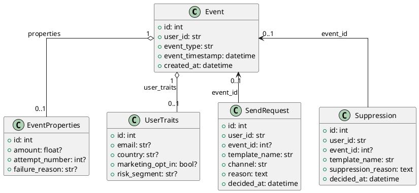
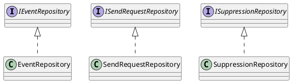
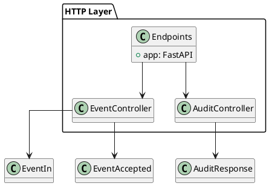
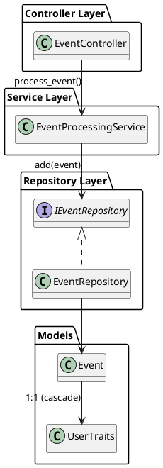

# Step Summary — Step 1 (DB & Models)

## What was done
- Added synchronous SQLAlchemy bootstrap (`engine`, `SessionLocal`, `create_session()`).
- Updated UTC helper to use `datetime.now(timezone.utc)`.
- Implemented ORM models:
  - Event
  - EventProperties (explicit columns: amount, attempt_number, failure_reason)
  - UserTraits (explicit columns: email, country, marketing_opt_in, risk_segment)
  - SendRequest
  - Suppression
- Enforced 1:1 mapping between Event and properties/traits using unique event_id.

## PlantUML (Models Diagram)



# Step Summary — Step 2 (Alembic Migrations)

## What was done
- Wired Alembic to SQLAlchemy metadata (`Base.metadata`) so Alembic understands our schema.
- Loaded DATABASE_URL from `.env` in Alembic runtime.
- Added initial migration `create_initial_tables` creating all required tables and indexes.
- Implemented a clean downgrade reversing table creation order.


# Step Summary — Step 3 (Minimal Repositories)

## What was done
- Introduced a minimal repository layer.
- Removed event_properties and user_traits repositories.
- Removed all prediction-based query methods.
- Added only add() for all entities and get_by_id() for Event.
- Prepared the layer for expansion during Service implementation.

## UML


# Step Summary — Step 4 (Controller Layer)

## What was done
- Implemented controllers: EventController and AuditController.
- Added Pydantic schemas for event ingestion and audit responses.
- Assembled all routers inside `controllers/endpoints.py`.
- Moved FastAPI app creation to `endpoints.py`.
- Updated `main.py` to serve purely as a uvicorn launcher.
- Ensured dependency injection for DB sessions (synchronous).

## Final File Structure
```
controllers/
├── audit_controller.py
├── endpoints.py
└── event_controller.py
schemas/
├── audit.py
└── event.py
main.py
```

## Updated UML


# Step Summary — Step 5.1 (Event Persistence)

## What Was Implemented
- Added EventProcessingService with the responsibility to persist:
  - Event including dynamic JSON properties
  - UserTraits (1:1) via ORM cascade
- Integrated service into POST /events controller
- Implemented and validated service behavior through tests

## Key Change
UserTraits are now persisted by setting `event.user_traits = UserTraits(...)` and allowing SQLAlchemy to cascade persistence.

## Completed Tests
- Service-level test confirming event + properties + traits persistence and relationship integrity
- Controller test ensuring the endpoint returns `{"status": "accepted"}` and data is saved properly

## PlantUML
